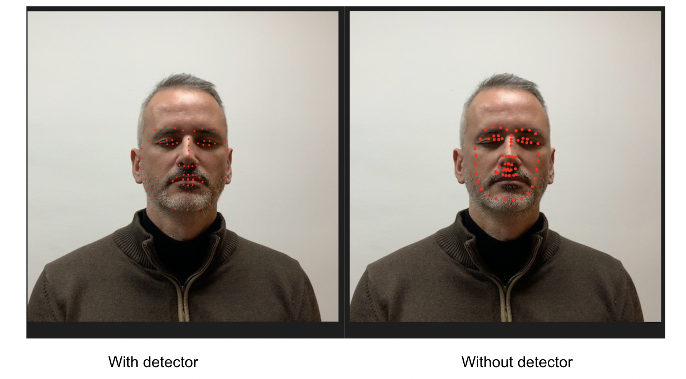
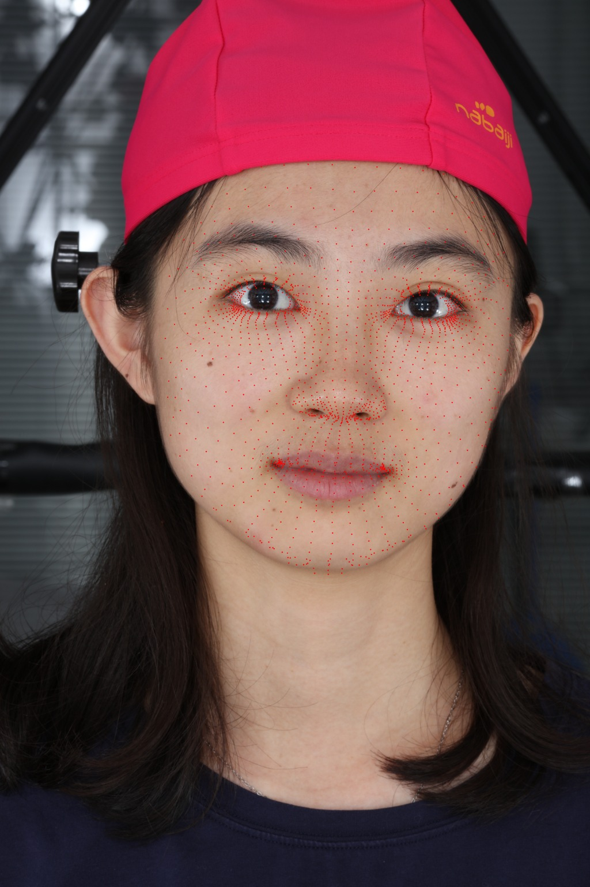

# dense-face-alignment

Most of the existing face-alignments detects the standard 68 face landmarks. However, there is a need of dense facial landmarks for tasks such 3d face reconstruction, face recognition etc. [DAD-3DHeads](https://github.com/PinataFarms/DAD-3DHeads) proposed a dense 2d landmark detector based on 3D face reconstruction. However, their performance deteriorates when face is only a part of the image. see figure below. To improve on this, I used mediapipe facial detector to detect the face, use the detected face to DADNet and then project back the detected landmarks in the original image coordinate.

      

## Dependencies

`
pip install -r requirements.txt
`

Note: if you are using mac silicon replace mediapipe with mediapipe-silicon in requirements.txt

## How to replicate the results

`
python run.py -h
`

sample command

`
python run.py --data_path sample_input --num_points 445 
`

sample command for custom points

`
python run.py --data_path sample_input --custom_index model_training/model/static/face_keypoints/ids1.npy
`

## Attributions
this repo is built on top of base code from [DAD-3DHeads](https://github.com/PinataFarms/DAD-3DHeads)
